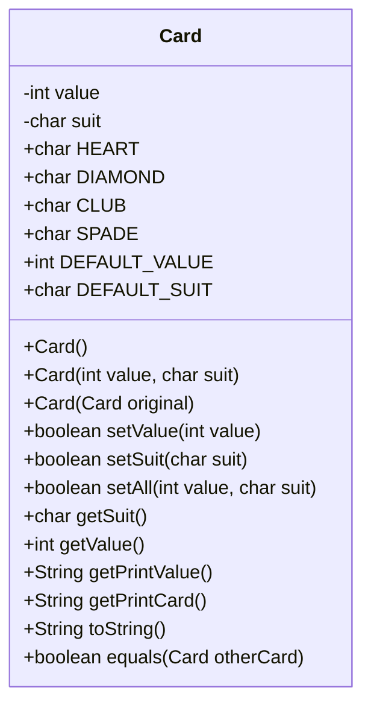

# Final Project: JavaFX GUI Application

In this final project, you will design and build a GUI application using **Java**, **JavaFX**, **SceneBuilder**, **IntelliJ IDEA**, and **GitHub**.

Your project must include:

1. A clear project idea
2. A GUI wireframe
3. A JavaFX application built with SceneBuilder
4. At least one model class designed with UML
5. Java code that implements and tests your model class
6. A completed final application
7. An updated README with final screenshots, wireframes, and UML diagrams

---

## Project Overview

Write a brief description of your project here.

Your description should explain:

* What your application does
* Who the application is for
* What problem it solves or what task it helps with
* What the user will be able to do in the GUI

# Phase 1: Design the GUI

Before writing the full application, you will design the visual layout of your project.

## 1. Create a Wireframe

Create a wireframe that shows the planned layout of your GUI.

Your wireframe should show:

* Windows, screens, or major sections of the application
* Layouts and controls
* Clearly labeled JavaFX components (AnchorPane, VBox, Label, Button, TextField, etc.)

You may create your wireframe using any reasonable tool, including:

* Paper and pencil
* diagrams.net / Draw.io
* Canva
* Google Slides
* Figma
* Any other wireframing tool

## 2. Add Your Wireframe to This README

Save your wireframe image in your project folder and embed it below using Markdown.

Example:

```markdown

```

### GUI Wireframe

* Replace the example below with your wireframe image.*


## 3. Build the GUI in SceneBuilder

After creating your wireframe, build your GUI using **SceneBuilder**.

At this stage, your GUI does not need to be fully functional. The goal is to create the visual structure of your application.

---

# Phase 2: Design and Build a Model Class

In this phase, you will design and implement at least one **model class** for your project.

A model class represents the data or logic used by your application.

Your model class **cannot** be:

* Your application class
* Your JavaFX controller class
* A class that only exists to launch the GUI

Good model classes usually represent an important object in your project.

Examples:

* `Student`
* `User`
* `Recipe`
* `Book`
* `GameCharacter`
* `GamePiece`
* `PlayingCard`
* `Pokemon`
* `Trainer`

## 1. Create a UML Class Diagram

Create a UML class diagram for at least one model class in your project.

Your UML diagram should include:

* Class name
* Fields / instance variables
* Constructors
* Methods
* Visibility symbols such as `+` and `-`

You may use Mermaid, PlantUML, diagrams.net, Lucidchart, Visual Paradigm, or another UML tool.

## UML Class Diagram

*Add your UML class diagram here.*

You may use [Mermaid](https://mermaid.ai/open-source/syntax/classDiagram.html)  directly in this README.

Here is is an example of the `Card` class that we created in a previous lab.
```
classDiagram
    class Card {
        -int value
        -char suit

        +char HEART
        +char DIAMOND
        +char CLUB
        +char SPADE

        +int DEFAULT_VALUE
        +char DEFAULT_SUIT

        +Card()
        +Card(int value, char suit)
        +Card(Card original)

        +boolean setValue(int value)
        +boolean setSuit(char suit)
        +boolean setAll(int value, char suit)

        +char getSuit()
        +int getValue()

        +String getPrintValue()
        +String getPrintCard()

        +String toString()
        +boolean equals(Card otherCard)
    }
```
The code above renders the following UML class diagram.


## 2. Implement Your Model Class

Create your model class in the appropriate source folder of your project.

Your class should include:

* Private instance variables
* At least one constructor
* Getter and setter methods as appropriate
* At least one method that performs a meaningful action or calculation
* A `toString()` method

Your class should be related to your final project.

## 3. Create a Tester Class

Create a separate tester class with a `main` method.

Use the tester class to:

* Create objects of your model class
* Call each constructor
* Test each method
* Print results to the console
* Confirm that your class works before connecting it to the GUI

Your tester class is separate from your JavaFX application.

---

# Phase 3: Complete the Application

In this phase, you will finish building your JavaFX project and update this README file.

You will present your project to the class during our last class meeting.
## Final Application Requirements

Your completed project should include:

* A working JavaFX GUI
* At least one model class used meaningfully
* Updated project documentation in this README

Your application should allow the user to interact with the program in a meaningful way.

Examples of meaningful interaction include:

* Entering information
* Clicking buttons
* Viewing calculated results
* Adding, editing, or removing data
* Displaying messages or feedback
* Updating the interface based on user input

---

# Final README Updates

Before submitting your final project, update this README so that it accurately represents your completed application.

Your final README should include:

* A complete project description
* Final wireframe image or updated GUI design
* UML class diagram for your model class
* Screenshots of your completed application
* A short explanation of how the user interacts with your application
* Any known issues or unfinished features

## Final Application Screenshots

*Add screenshots of your completed application here.*


## How to Use the Application

Explain how someone should use your application.

*Write instructions here.*

## Known Issues

List any bugs, missing features, or limitations.

*Write known issues here, or write “None” if there are no known issues.*

---

# Submission Checklist

Before submitting, make sure your project includes:

* [ ] Project description
* [ ] GUI wireframe
* [ ] JavaFX GUI built with SceneBuilder
* [ ] UML class diagram
* [ ] Model class
* [ ] Tester class with a `main` method
* [ ] Main JavaFX application class
* [ ] Controller class
* [ ] Working user interaction
* [ ] Final screenshots
* [ ] Updated README
* [ ] Project pushed to GitHub
